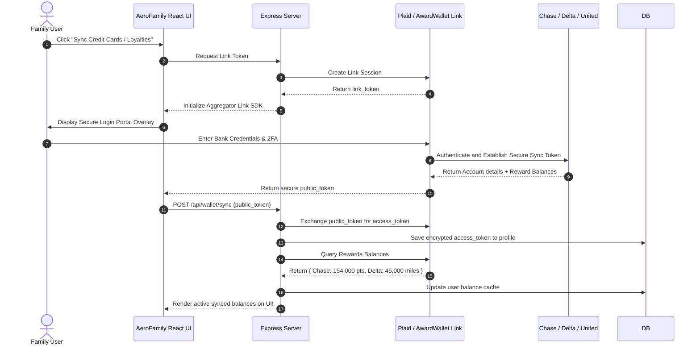

# 🧭 Architectural Blueprint: Banking Portal Integration & Reward Balance Sync

Connecting AeroFamily directly to banking portals (Chase Ultimate Rewards, Amex Travel, Capital One) and airline loyalty accounts to **automatically pull point balances** and **evaluate portal booking benefits** is the ultimate tier of financial travel automation.

Below is an engineering design detailing how to securely sync points balances using industry-standard aggregators and compile portal booking trade-offs.

---

## 🏗️ 1. Complete Integration Architecture

Because major banks do not expose public developer APIs for rewards due to security regulations, we utilize secure financial data aggregators (**Plaid** and **AwardWallet**):



---

## 📡 2. API Aggregation Partners

To query real-time reward balances, AeroFamily integrates two specialized APIs:

### A. Plaid API (Accounts & Liabilities)
*   **Role**: Connects to major US credit card portals (Chase, Amex, Capital One, Citi).
*   **Capabilities**: Plaid’s `accounts/get` endpoint returns account metadata, which includes the active **rewards balance** (points/miles) for premium credit cards.
*   *Plaid Payload Example*:
    ```json
    {
      "account_id": "acc_chase_123",
      "name": "Chase Sapphire Reserve",
      "type": "credit",
      "subtype": "credit card",
      "balances": {
        "current": 894.20
      },
      "rewards": {
        "type": "Ultimate Rewards",
        "balance": 154230
      }
    }
    ```

### B. AwardWallet Email & Loyalty API
*   **Role**: The global standard for tracking airline and hotel loyalty accounts (Delta SkyMiles, United MileagePlus, Marriott Bonvoy, etc.).
*   **Capabilities**: Offers a **Developer API** that securely stores user credentials in an encrypted vault and queries active miles/points balances periodically via screen-scraping or direct airline contracts.

---

## 📋 3. Portal Booking Benefits & Trade-offs Engine

Booking through a bank's travel portal (Chase Ultimate Rewards, Capital One Travel, Amex Travel) vs. booking **Direct with the Airline** has distinct advantages and heavy risks that our engine maps:

```
+-----------------------------------------------------------------------------------+
| 🌐 BANK TRAVEL PORTAL ANALYSIS (ATL -> SJU Flight)                                |
+------------------+----------------------------------+-----------------------------+
| PARAMETER        | BOOKING THROUGH PORTAL           | BOOKING DIRECT WITH AIRLINE |
+------------------+----------------------------------+-----------------------------+
| Portal Option    | Chase Travel Portal (CSR Card)   | Direct Airline Booking      |
| Effective Rate   | 1.5¢ per point value             | 1.0¢ per point value        |
| Total Points     | 14,800 Chase Points              | 22,200 Chase Points         |
| Earn Multipliers | 🚀 5x points earned on flights   | 3x points earned on travel  |
| Price Protection | ❌ None                          | ❌ None                     |
| Delay / IRROPS   | ⚠️ HIGH RISK: Chase acts as a     | 🟢 SAFE: Airline handles    |
|                  |   3rd-party agency. Changes are  |   delay accommodations and  |
|                  |   highly difficult during storm  |   rebookings directly at the|
|                  |   cancellations and travel delays|   airport gate.             |
+------------------+----------------------------------+-----------------------------+
```

---

## 🎨 4. Proposed Web UI Loyalty Sync Interface

Inside the **Settings & Wallet** tab, users link their reward portfolios:

```
+-----------------------------------------------------------+
| 🪙 MY SYNCED REWARDS & LOYALTIES                          |
| Connect your accounts to automatically search award fares. |
|                                                           |
| Synced Portals:                                           |
| • 💳 Chase Ultimate Rewards:   154,230 pts    [ 🔄 Sync ] |
| • 💳 Amex Membership Rewards:   84,500 pts    [ 🔄 Sync ] |
| • ✈️ Delta SkyMiles:            42,100 miles  [ 🔄 Sync ] |
|                                                           |
| [ ➕ CONNECT NEW BANK / AIRLINE ACCOUNT ]                  |
+-----------------------------------------------------------+
```

---

## 🔒 5. Security & Data Isolation Protocols

Since this involves highly sensitive financial details:
1. **Zero Credential Storage**: AeroFamily *never* handles or stores raw bank passwords. All authentications are executed inside Plaid's native secure iframe link SDK.
2. **Encrypted Access Tokens**: Access tokens returned by Plaid are encrypted at rest using AES-256 before being written to Firestore `/profiles/{userId}`, using keys secured inside Firebase Environment Secrets.
3. **Periodical Cache Updating**: Rewards balances are updated on a daily background worker trigger to avoid constantly polling bank services and triggering security flags.
