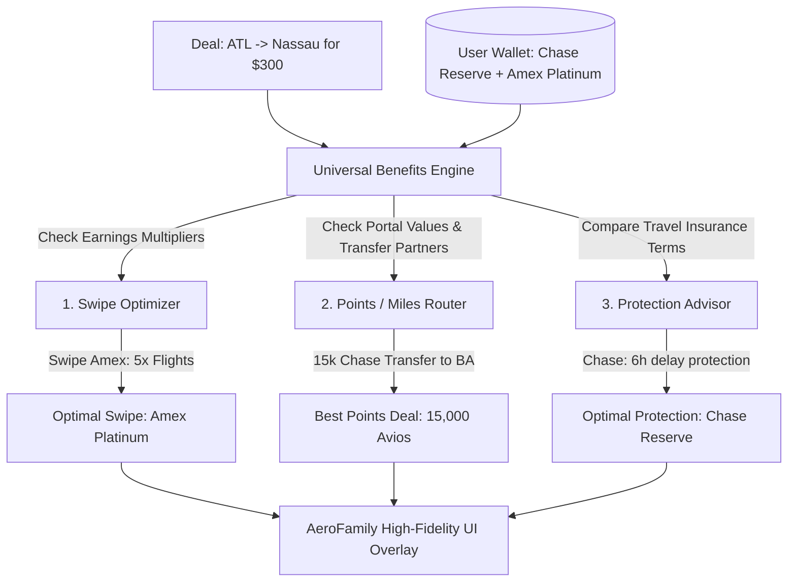

# 💳 AeroFamily Product Blueprint: Universal Credit Card Rewards & Travel Benefits Engine

Integrating a **Universal Credit Card Rewards & Travel Benefits Engine** into AeroFamily addresses a massive gap in modern travel planning: it tells travelers **exactly which card to swipe or transfer points to** for any specific flight deal, based on points multipliers, portal values, and trip insurance benefits.

---

## 🏗️ 1. Complete System Architecture

The Benefits Engine is a stateless rule compiler. It takes the **scanned flight deal** and compiles it against the **user's toggled credit card wallet** to output points valuations and travel insurance advice:



---

## 💾 2. Credit Cards Database Schema (`data/credit_cards.json`)

To power the engine, we will establish a structured database for all major travel cards:

```json
{
  "chase_sapphire_reserve": {
    "name": "Chase Sapphire Reserve®",
    "points_program": "Chase Ultimate Rewards",
    "valuation_cents_per_point": 2.0,
    "portal_multiplier": 1.5,
    "earn_multipliers": {
      "flights_portal": 5.0,
      "flights_direct": 3.0,
      "general_travel": 3.0
    },
    "transfer_partners": ["HYA", "UAL", "BAW", "SIA", "SWR", "BAW"],
    "insurance": {
      "trip_cancellation": "Up to $10,000 per person / $20,000 per trip",
      "trip_delay": "Reimbursement up to $500 per ticket after 6 hours",
      "baggage_delay": "Up to $100 per day for 5 days after 6 hours",
      "rental_car_cdw": "Primary coverage (up to $75,000 for collision)"
    }
  },
  "amex_platinum": {
    "name": "The Platinum Card® from American Express",
    "points_program": "Amex Membership Rewards",
    "valuation_cents_per_point": 2.0,
    "portal_multiplier": 1.0,
    "earn_multipliers": {
      "flights_portal": 5.0,
      "flights_direct": 5.0,
      "general_travel": 1.0
    },
    "transfer_partners": ["DAL", "SIA", "ANA", "BAW", "HAL", "EAA"],
    "insurance": {
      "trip_cancellation": "Up to $10,000 per trip / $20,000 per year",
      "trip_delay": "Reimbursement up to $500 per ticket after 12 hours",
      "baggage_delay": "❌ None",
      "rental_car_cdw": "Secondary coverage"
    }
  }
}
```

---

## ⚙️ 3. Optimal Swipe & Insurance Selector Algorithm

When a cash booking of `$X` is calculated, the engine evaluates the optimal card strategy:

### A. Point Earnings Calculator
$$\text{Amex Platinum Value} = \text{Price (\$300)} \times \text{5x multiplier} \times \text{2.0\text{c} valuation} = \$30.00 \text{ return}$$
$$\text{Chase Reserve Value} = \text{Price (\$300)} \times \text{3x multiplier} \times \text{2.0\text{c} valuation} = \$18.00 \text{ return}$$

### B. Travel Protection Compiler
The algorithm compares the `trip_delay` and `rental_car_cdw` fields:
*   Amex Platinum triggers trip delay compensation after **12 hours**; Chase Sapphire Reserve triggers it after **6 hours**.
*   Amex Platinum provides **Secondary** car rental collision coverage; Chase Sapphire Reserve provides **Primary** coverage.
*   *Verdict*: Chase Sapphire Reserve wins the **Protection Advisor** recommendation.

---

## 🎨 4. Proposed Web UI Deal Accordion

When clicking on a flight deal (e.g. Nassau, Bahamas for $298), a **Points & Swipes Panel** expands:

```
+-----------------------------------------------------------+
| 💳 AERO-FINANCE REWARDS & BENEFITS INSIGHT                 |
|                                                           |
| 1. BEST POINTS ROUTE:                                     |
|    • Transfer 15,000 Chase Points to British Airways      |
|      (To book on American Airlines partner flight)        |
|      Value: Saves $298 Cash (2.0¢ per point value!)       |
|                                                           |
| 2. OPTIMAL SWIPE (IF PAYING CASH):                        |
|    • Swipe: Amex Platinum Card                            |
|      Earnings: Earns 1,490 Points (~$30 travel value)     |
|                                                           |
| 3. TRAVEL PROTECTION RECOMMENDATION:                      |
|    • Recommendation: Chase Sapphire Reserve               |
|      Why: Earns 894 Points (~$18 return) BUT unlocks      |
|      Superior 6h Trip Delay & Primary Rental Insurance    |
|      (Amex Platinum requires 12h delay for coverage).     |
+-----------------------------------------------------------+
```

---

## 🚀 5. Implementation Roadmap

### Phase 1: Database Setup
Create `data/credit_cards.json` containing the rules parameters for the top 10 travel cards (Chase Reserve/Preferred, Amex Platinum/Gold, Capital One Venture X/Venture, Citi Premier/Double Cash, Bilt Mastercard).

### Phase 2: Refactor `App.jsx` Settings Panel
Update the Card Wallet checklist so users can toggle which cards they currently hold.

### Phase 3: The Compiler Engine (`server.js` or `agent.js`)
Implement `calculatePointsStrategy(dealPrice, airlines, userCards)` which returns the structured points, swipes, and protection advice arrays. Append this directly to the deal payload when requested.
