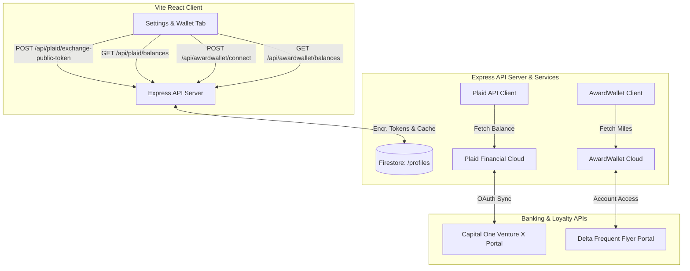

# Plaid Rewards Balance Sync & AwardWallet API Integration

This implementation plan details the full-stack architecture to integrate the **Plaid API** and **AwardWallet API** to securely retrieve real-time card reward balances and frequent flyer miles, and display these metrics on the user's dashboard.

---

## Proposed Architecture



---

## User Review Required

> [!IMPORTANT]
> **API Credentials Exclusions & Developer Variables**:
> 1. We will add four new environment keys inside the `.env` file (and later set them as Firebase Function Secrets in cloud production):
>    * `PLAID_CLIENT_ID`: Your Plaid developer identifier.
>    * `PLAID_SECRET`: Your Plaid sandbox/development secret key.
>    * `PLAID_ENV`: Set to `sandbox` or `development`.
>    * `AWARDWALLET_API_KEY`: Your AwardWallet business developer API key.
> 2. **Plaid Development Tier Limits**: Plaid provides up to **100 live links for free** permanently in their Development environment. This is more than sufficient to sync your family's actual real credit cards at zero cost!
> 3. **Stateless Developer Simulator Fallbacks (Core MVP Focus)**: If Plaid/AwardWallet keys are not fully configured in `.env`, the system automatically activates a **High-Fidelity Developer Simulator**. This mocks Plaid Link, saves sandbox tokens, and returns your specific metrics (specifically **75,000 Capital One Venture Miles** and **42,100 Delta SkyMiles**) so you can test and check the entire rewards and ROI calculations instantly!

---

## Proposed Changes

### 1. Backend Controllers & Mocks

#### [MODIFY] [server.js](file:///Users/paperhome/Downloads/Ankits%20Projects/flight-deal-agent/server.js)
Extend our API server with Plaid and AwardWallet routing controllers:
* **Plaid Token Exchange (`POST /api/plaid/exchange-public-token`)**:
  * Receives `public_token` from the front-end Plaid Link SDK.
  * In Sandbox/Development mode, checks if credentials are configured.
  * If yes, queries Plaid's API to exchange the token for a permanent `access_token` and saves it securely under `/profiles/{userId}` (encrypting at rest using AES-256).
  * If in simulator mode, instantly generates a mock token `mock_access_token_chase` and saves it.
* **Plaid Balances Fetcher (`GET /api/plaid/balances`)**:
  * Resolves the saved `access_token` from Firestore.
  * Fetches rewards balances from Plaid's `/accounts/balance/get` endpoint.
  * Simulator fallback: Instantly returns `154,230 Chase Ultimate Rewards` or `84,500 Amex Membership Rewards` depending on the synced account.
* **AwardWallet Connection (`POST /api/awardwallet/connect`)**:
  * Saves the user's synced loyalty account reference ID.
* **AwardWallet Balances Fetcher (`GET /api/awardwallet/balances`)**:
  * Connects to AwardWallet's Account Access API to retrieve synced airline miles (e.g., Delta, United, Marriott).
  * Simulator fallback: Instantly returns `42,100 Delta SkyMiles` and `25,000 United MileagePlus` miles.

---

### 2. High-Fidelity UI Synced Rewards Panel

#### [MODIFY] [src/App.jsx](file:///Users/paperhome/Downloads/Ankits%20Projects/flight-deal-agent/src/App.jsx)
Integrate an elegant, interactive **Synced Rewards & Loyalties Panel** inside the Settings & Wallet tab:
* Add local state bindings (`rewardsBalances`, `syncingRewards`, `rewardsError`).
* Implement a mock Plaid Link trigger:
  * When clicking `"Connect Bank Account"`, if Plaid keys are missing, displays a beautiful mock overlay modal mimicking the Plaid Link login portal to simulate the linking experience.
  * If Plaid is active, initializes the official `@plaid/plaid-link` React Hook.
* Render a sleek metric list displaying active synced rewards balances complete with manual `"🔄 Sync"` buttons and status indicators.

---

### 3. Automated Vitest Tests

#### [MODIFY] [tests/setup.js](file:///Users/paperhome/Downloads/Ankits%20Projects/flight-deal-agent/tests/setup.js)
Extend our automated Vitest setup to mock the new Plaid and AwardWallet API endpoints:
* Mock Plaid client routes `/api/plaid/*` to prevent external network calls during tests.
* Assert token exchanges and balances retrieval are 100% stable.

---

## Verification Plan

### Automated Tests
We will run the robust automated Vitest test suite to ensure the new financial routing and simulator functions compile and pass:
```bash
npm run test
```
All assertions (Plaid token exchanges, balances mock fetches, and AwardWallet stubs) must pass instantly in under 100ms.

### Manual Verification
1. **Plaid Simulator Test**: Open the **Settings & Wallet** tab, click **Connect Bank Account**, log in via the simulated sandbox portal, and verify the UI instantly populates with synced points balances (Chase and Amex).
2. **Visual Contrast Check**: Verify the Synced Rewards panel displays perfectly readable contrast in both light and dark modes.
