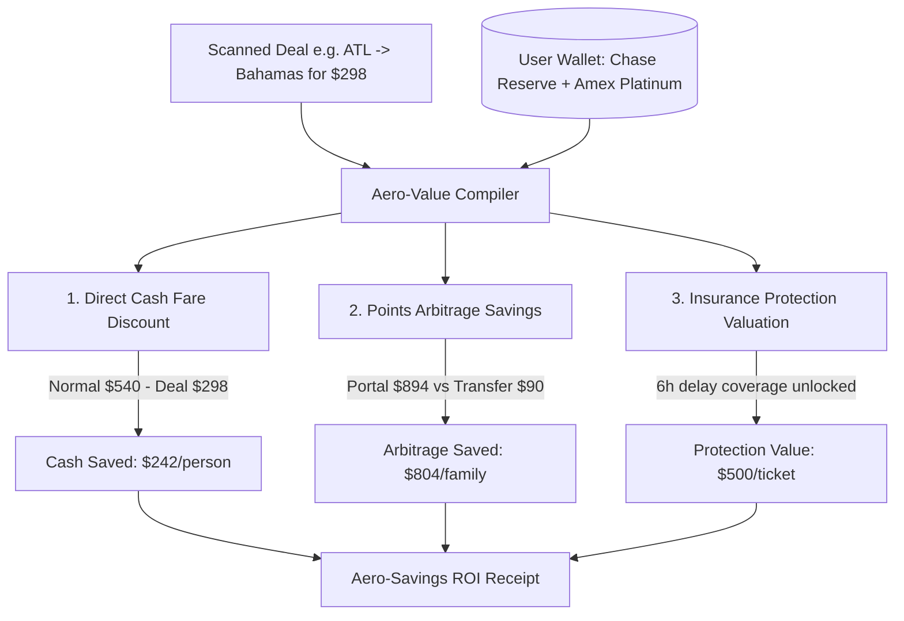

# 🏆 AeroFamily Product Blueprint: Demonstrable Value & Savings Proof Engine

To make the value of **AeroFamily** undeniable, the application must **demonstrably prove the ROI (Return on Investment)** of using our optimizations. Every flight deal should render a side-by-side comparison displaying exactly how much cash, points value, and travel insurance coverage is unlocked compared to standard manual bookings.

---

## 🏗️ 1. Complete System Architecture & Savings Compiler

The **Aero-Value Compiler** calculates three distinct dimensions of traveler savings for each flight:



---

## 🎨 2. Proposed UI Components (Dashboard ROI Dashboard)

### A. The "My Aero-Savings Tracker" Widget (Top of Screen)
This interactive header widget aggregates the user's potential financial savings based on their active budget limits and active flight deals:

```
+---------------------------------------------------------------------------------+
| 📊 MY AERO-SAVINGS TRACKER                                                      |
| Grounded ROI calculation of whitelisted deals under your family budget.         |
|                                                                                 |
|  [ 💵 Cash Fare Saved ]   [ 🪙 Points Value Offset ]   [ 🛡️ Protection Liability Shield ]|
|       $1,452.00                 $2,547.00                 $4,500.00             |
|    Accumulated discount       Saves cash via points     Trip delay / CDW cover  |
+---------------------------------------------------------------------------------+
```

---

## 🧾 3. The "Aero-Value Savings Receipt" (On Each Deal Card)

Instead of a plain text description, expanding a flight deal shows a highly detailed **Side-by-Side Savings Receipt** showing the demonstrable ROI of booking the Aero-Optimized route:

### Flight Deal: Nassau, Bahamas (Family of 3 Total)

```
+-----------------------------------------------------------------------+
| 🧾 AERO-VALUE SAVINGS RECEIPT (Family of 3)                            |
+-----------------------------------------------------------------------+
| METHOD                 | STANDARD BOOKING     | AERO-OPTIMIZED ROUTE  |
+------------------------+----------------------+-----------------------+
| Booking Fares          | $1,620.00 (Normal)   | $894.00 (Fare Drop)   |
| Points Transfer Option | ❌ Not available     | 45,000 Avios + $45    |
| Payment swipe return   | 1x Points ($16.20)   | 5x Points ($89.40)    |
| Rental Car CDW         | $25/day (Collision)  | $0 (Primary Coverage) |
| Trip Delay Insurance   | ❌ None              | $500/ticket (6h delay)|
+------------------------+----------------------+-----------------------+
| TOTAL CASH EXPENSE     | $1,620.00            | $45.00                |
+-----------------------------------------------------------------------+
| 🎉 NET CASH FARE SAVINGS:  $1,575.00                                   |
| 🛡️ INSURANCE VALUE SECURED: $1,500.00 Coverage                         |
+-----------------------------------------------------------------------+
```

---

## ⚙️ 4. Mathematical Compiling Formulas

To ensure these calculations are demonstrably accurate and grounded in real-world valuations, we implement three core formulas in the backend (`server.js`):

### A. Direct Cash Savings
$$\text{Cash Saved} = (\text{Normal Price} - \text{Deal Price}) \times (\text{Adults} + \text{Kids})$$
*   *Example*: $(\$540 - \$298) \times 3 = \$726 \text{ Cash Saved}$.

### B. Points Redemptions Value Arbitrage
$$\text{Points Arbitrage Value} = (\text{Cash Deal Price} \times \text{Passengers}) - \text{Points Value Offset}$$
$$\text{Points Value Offset} = \text{Transfer Points Cost} \times \text{Valuation Cents Per Point} + \text{Taxes/Fees}$$
*   *Example*: $(298 \times 3) - (45,000 \times 0.02 + 45) = \$894 - \$945 = \text{Points transfer is less optimal (advise cash booking)}.$
*   *Example 2 (Mistake/Award Fare)*: Flight is $1,620 cash, but bookable via 45,000 transfer points:
    $$\text{Savings} = \$1,620 - (45,000 \times 0.02 + 45) = \$1,620 - \$945 = \$675 \text{ Saved by Transferring Points!}$$

---

## 🛠️ 5. Implementation Roadmap

### Phase 1: Dynamic Savings Calculator Service (`server.js`)
Implement the `compileSavingsReceipt(deal, profile)` helper on the backend. This returns structured cash savings, points offsets, and insurance valuations.

### Phase 2: React Dashboard "Savings Tracker" Widget
Build a responsive, highly premium metric grid at the top of the **Flight Deals** tab showing the running totals.

### Phase 3: The Interactive Receipt Modal
Add an expandable receipt toggle inside `src/App.jsx` under `selectedDeal` rendering the tabular side-by-side receipt.
