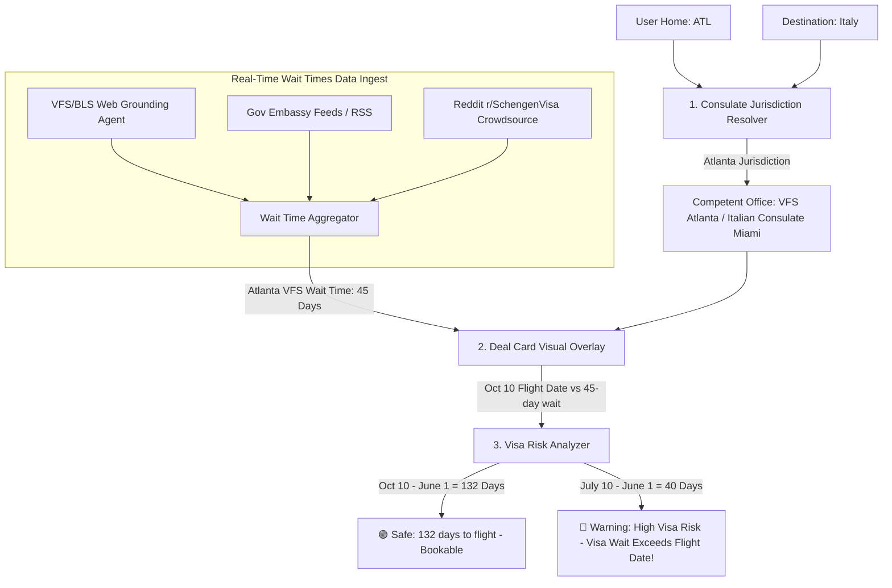

# ⏳ Architectural Proposal: Visa Appointment Wait Times & Consulate Locator

For flight deals that require an **Embassy Visa** (e.g. a Schengen Visa for Italy/France or a UK Standard Visitor Visa), the primary booking blocker is not the price—it is **securing a visa appointment in time**.

Below is the system architecture to locate the user's nearest competent consulate and track/display real-time visa appointment wait times.

---

## 🏗️ 1. Complete System Architecture

To map consulate jurisdictions and estimate visa appointment availability, AeroFamily uses a **Consulate Mapping Engine** coupled with a **Gemini-Powered Slot Scraper / Web Grounding Worker**:



---

## 🌎 2. Consulate Jurisdiction Mapping Engine

Since foreign consulates only accept visa applications from residents within their specific **states of jurisdiction**, AeroFamily will map the user's home state (derived from their whitelisted departure airport) to the competent consulate:

### Jurisdiction Mapping Schema (`data/consulates.json`)
```json
{
  "ITA": {
    "jurisdictions": [
      {
        "office": "Italian Consulate General, Miami",
        "vfs_center": "VFS Global Atlanta",
        "states_covered": ["GA", "FL", "AL", "MS", "SC"],
        "booking_portal": "https://visa.vfsglobal.com/usa/en/ita"
      },
      {
        "office": "Italian Consulate General, New York",
        "vfs_center": "VFS Global New York",
        "states_covered": ["NY", "NJ", "CT", "PA"],
        "booking_portal": "https://visa.vfsglobal.com/usa/en/ita"
      }
    ]
  }
}
```

---

## 📡 3. Data Sourcing Strategies (API & Scrapers)

Obtaining real-time appointment slot availability for private visa facilitators (like VFS Global or BLS International) is complex due to strict anti-bot captchas on their active booking portals. We propose a three-pronged sourcing architecture:

1. **Gemini Web Grounding Worker (Scheduled every 12 hours)**:
   * AeroFamily deploys a background Gemini agent configured to search the live web for recent visa slot reports, community notifications, and telegram channels.
   * *Search Query*: `"current Schengen visa appointment wait times Atlanta VFS Italy 2026"` or `"VFS Atlanta Italian visa appointment slot availability May 2026"`.
   * Gemini aggregates these search reports and extracts structured wait times.
2. **Gov API Integrations**:
   * For outbound US visa applicants, query the official US State Department API directly to fetch real-time wait times for tourist/student visas:
     `https://travel.state.gov/content/travel/resources/database/visa-wait-times.html?cid=ATL&aid=VisaWaitTimes`
3. **Crowdsourced User Reports**:
   * Allow AeroFamily community members to log their secured appointment dates inside the app. If a user logs: *"Secured Schengen slot in VFS Chicago on June 15"*, the system updates the average wait times for Chicago instantly.

---

## 🎨 4. High-Fidelity UI Presentation

When a deal requiring a visa is opened on the dashboard, it renders a **Logistics Details Accordion**:

### Visual Deal Details Card:
```
+-----------------------------------------------------------+
| 🇮🇹 ROME, ITALY (FCO)                                $450  |
| Outbound: Oct 10, 2026 • Return: Oct 17, 2026             |
|                                                           |
| 🔴 EMBASSY VISA REQUIRED                                  |
|                                                           |
| • Nearest Consulate: Italian Consulate General, Miami     |
| • Your Competent VFS Center: VFS Global Atlanta, GA       |
| • Current Appointment Wait Time: ⏳ ~45 Days              |
|                                                           |
| 🟢 VISA RISK: SAFE                                        |
| You have 132 days until departure. Submitting your        |
| application within the next 45 days is highly safe.      |
|                                                           |
| [ 📋 BOOK FLIGHT ]          [ 📅 BOOK VFS APPOINTMENT ]   |
+-----------------------------------------------------------+
```

### High-Risk Warning Card:
If the user views a flight departing in 30 days but the visa wait time is 45 days:
```
+-----------------------------------------------------------+
| ⚠️ VISA RISK WARNING: HIGH RISK                           |
|                                                           |
| Flight Departure: 30 Days (June 30)                       |
| VFS Visa Wait Time: 45 Days (Est. July 15)                |
|                                                           |
| Booking this flight is HIGHLY DISCOURAGED unless you      |
| already hold an active, multiple-entry Schengen Visa.     |
+-----------------------------------------------------------+
```

---

## 🚀 5. Implementation Plan

### Phase 1: Jurisdiction Database
Establish the `data/consulates.json` mapping configuration for top Schengen/UK destinations.

### Phase 2: Live Grounding Worker (`server.js`)
Add a scheduled backend task in Node that calls Gemini to scan recent travel forums and update `/airport_deals_cache` with a `visaWaitTimes` sub-document for that destination.

### Phase 3: Risk Analyzer Middleware
Implement a date comparison helper inside `server.js` or `src/App.jsx` that subtracts the current date from the flight's `outboundDate` and triggers the `🟢 Safe` or `🔴 High Risk` states dynamically based on the wait times.
