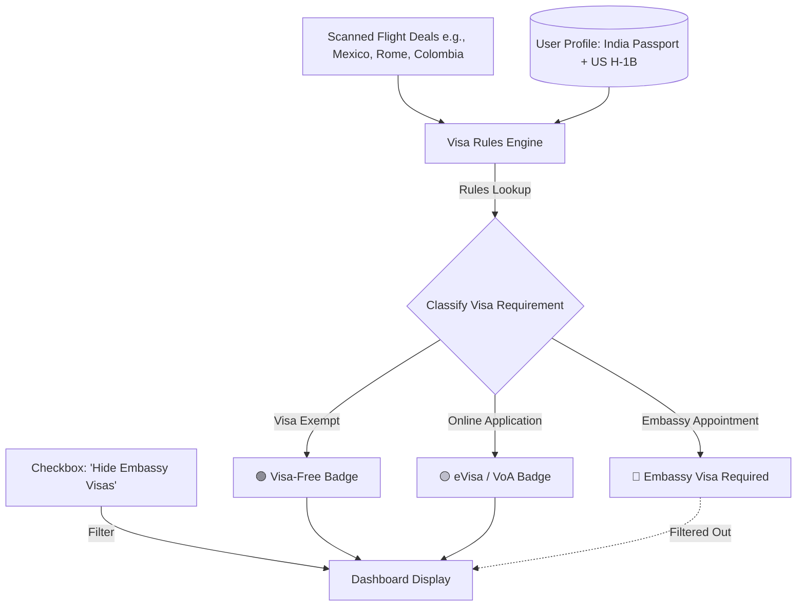

# 🛂 AeroFamily Product Blueprint: Dynamic Visa Optimizer & Passport Filter

For non-US citizens living in the United States (such as Indian passport holders on H-1B/F-1 visas or Green Cards), booking international flights is heavily restricted by visa logistics. Scheduling physical embassy interviews can take months. 

Google Flights entirely ignores this constraint. By integrating a **Dynamic Visa Classifier**, AeroFamily can provide an extremely high-value feature that solves this exact problem.

---

## 🏗️ 1. Architecture & Verification Flow

The Visa Optimizer acts as a rules engine between the raw Deals collected by the scanner and the UI presentation:



---

## 💾 2. User Profile Schema Upgrades (Firestore)

We will expand `/profiles/{userId}` to capture nationality and residency statuses:

```json
{
  "email": "traveler@gmail.com",
  "familyProfile": {
    "adults": 2,
    "kids": 1,
    "budget": 2500
  },
  "travelDocuments": {
    "passportCountry": "IND",
    "usResidencyStatus": "H1B",
    "hideEmbassyVisas": true
  }
}
```

---

## 📋 3. Sample Rules Engine Matrix (Focus: Indian Passport + US H-1B)

AeroFamily will store a structured rules matrix inside a lightweight JSON file or Firestore collection. Below is a subset of the travel matrix for **Indian Passport Holders** depending on their **US Visa Status**:

| Destination | Standard Indian Passport Rule | Rule IF holding Valid US Visa (H-1B / F-1 / Green Card) | AeroFamily Classification |
| :--- | :--- | :--- | :---: |
| **Mexico** (e.g. CUN) | Embassy Visa Required | **Visa Exempt** (up to 180 days) | 🟢 **Visa-Free** |
| **Colombia** (e.g. MDE) | Embassy Visa Required | **Visa Exempt** (up to 90 days) | 🟢 **Visa-Free** |
| **Bahamas** (e.g. NAS) | Embassy Visa Required | **Visa-on-Arrival** (up to 30 days) | 🟡 **eVisa / VoA** |
| **Turkey** (e.g. IST) | Embassy Visa Required | **eVisa** (Instant 30-day online application) | 🟡 **eVisa / VoA** |
| **United Kingdom** (LHR)| Embassy Visa Required | Embassy Visa Required | 🔴 **Embassy Required**|
| **Schengen Area** (FCO) | Embassy Visa Required | Embassy Visa Required | 🔴 **Embassy Required**|
| **Singapore** (SIN) | eVisa Required | **Visa-Free Transit** (up to 96 hours) | 🟢 **Visa-Free** (Transit) |

---

## 🎨 4. Proposed Web UI Integration

In `src/App.jsx`, we will add two simple onboarding dropdowns and a toggle:

### A. Settings Panel Inputs:
```
+-----------------------------------------------------------+
| 🛂 NATIONALITY & TRAVEL DOCUMENTS                         |
| Configure your passport details to filter travel visas.   |
|                                                           |
| Passport Country:                US Visa / Residency:     |
| [ 🇮🇳 India (IND)         ▼ ]    [ 💳 H-1B Work Visa     ▼ ]|
|                                                           |
| [X] Hide deals requiring in-person embassy visa interviews |
+-----------------------------------------------------------+
```

### B. High-Fidelity Deal Card Badging:
When a deal is rendered, it displays a colored badge based on the user's citizenship context:

#### Card 1: Cancun, Mexico ($289)
> `🟢 VISA-FREE (US VISA HOLDER EXEMPTION)`
> *"No visa required for Indian passport holders with an active H-1B visa."*

#### Card 2: Istanbul, Turkey ($410)
> `🟡 INSTANT EVISA (10 MIN ONLINE)`
> *"Eligible for single-entry eVisa. Applied online instantly with no embassy visit."*

#### Card 3: London, UK ($450)
> `🔴 EMBASSY VISA REQUIRED (EMBASSY VISIT)`
> *(Automatically hidden if the "Hide Embassy Visas" checkbox is toggled).*

---

## 🛠️ 5. Implementation Roadmap

### Phase 1: Establish the Visa Rules Database (`data/visa_rules.json`)
Create a structured JSON file mapping passport countries to destination exceptions based on US visas:
```json
{
  "IND": {
    "residency_exceptions": {
      "H1B": {
        "MEX": { "status": "visa_free", "note": "Visa exempt under active US visa." },
        "COL": { "status": "visa_free", "note": "Visa exempt under active US visa." },
        "TUR": { "status": "evisa", "note": "Eligible for online eVisa." }
      }
    },
    "default_rules": {
      "GBR": { "status": "embassy_required" },
      "ITA": { "status": "embassy_required" }
    }
  }
}
```

### Phase 2: Update the React Filtering Logic (`src/App.jsx`)
Integrate a `getVisaStatus(destinationAirport, passportCountry, usStatus)` helper inside `src/App.jsx` that automatically resolves the correct category badge and filters the horizontal scrolling bar dynamically.

### Phase 3: WhatsApp Alert Sync
When a new crowdsourced mistake fare or standard deal is sent on WhatsApp, the message body automatically prepends the visa info:
> *"🎉 Mistake Fare verified! ATL -> Cancun (CUN) for $180 roundtrip. 🟢 **VISA-FREE** for Indian Passports on H-1B! Tap [📝 Research] to build a stroller-friendly itinerary."*
